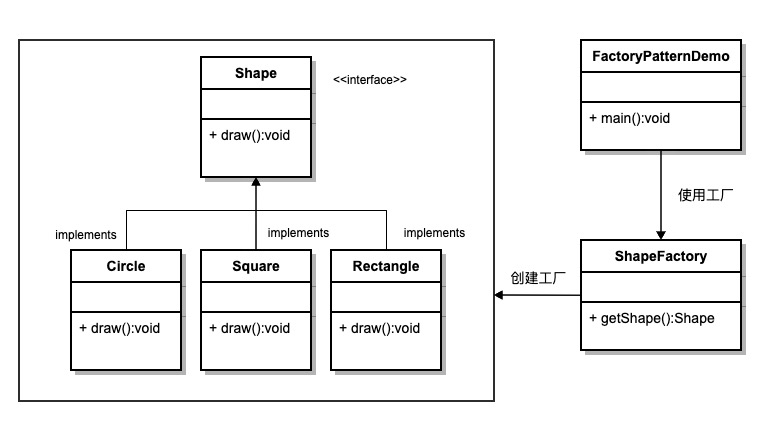
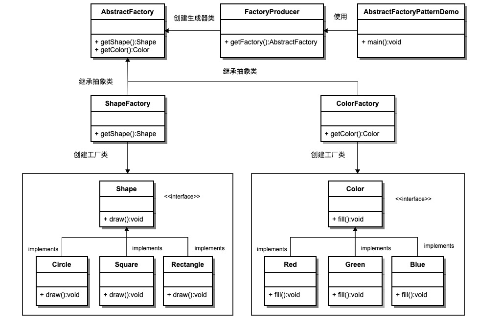

# 工厂模式

## 工厂模式介绍

工厂模式属于创建型模式，大致可以分为三类，简单工厂模式、工厂方法模式、抽象工厂模式。听上去差不多，都是工厂模式。下面一个个介绍，首先介绍简单工厂模式，它的主要特点是需要在工厂类中做判断，从而创造相应的产品。当增加新的产品时，就需要修改工厂类。有点抽象，举个例子就明白了。有一家生产处理器核的厂家，它只有一个工厂，能够生产两种型号的处理器核。客户需要什么样的处理器核，一定要显示地告诉生产工厂。下面给出一种实现方案。

## C++实现简单工厂模式

若有工厂模式如下图：
)

使用 c++实现应该为：

```cpp
#include <iostream>

class Shape
{
public:
  // 纯虚函数
  virtual void draw();
};

class Circle : public Shape
{
  void draw() { std::cout << "Draw Circle" << std::endl; }
};
class Square : public Shape
{
  void draw() { std::cout << "Draw Square" << std::endl; }
};

class Rectangle : public Shape
{
  void draw() { std::cout << "Draw Rectangle" << std::endl; }
};

class ShapeFactory
{

public:
  Shape *getShape(std::string shapeType)
  {
    // if (shapeType == nullptr){
    //     return nullptr
    // }
    if (shapeType == "Circle")
    {
      return new Circle();
    }
    else if (shapeType == "Square")
    {
      return new Square();
    }
    else if (shapeType == "Rectangle")
    {
      return new Rectangle();
    }
    else
    {
      return nullptr;
    }
  }
};
int main()
{

  return 0;
}

```

## C++实现抽象工厂模式

工厂方法模式也有缺点，每增加一种产品，就需要增加一个对象的工厂。如果增加多个产品就要设定多个工厂。在 C++实现中，就是要定义一个个的工厂类。显然，相比简单工厂模式，抽象工厂方法模式需要更多的类定义。

抽象工厂模式就是为了解决这个问题而产生的，它的定义为提供一个创建一系列相关或相互依赖对象的接口，而无需指定它们具体的类。例如这里定义了一个抽象工厂类，可以直接返回 Shape 工厂或者 Color 工厂，而无需关注工厂内部的实现。具体的 C++代码如下：



```cpp
#include <iostream>

class Shape
{
public:
    virtual void draw() = 0;
};
class Color
{
public:
    virtual void fill() = 0;
};
class AbstractFactory
{
public:
    virtual Shape *getShape(std::string shapeType) { return nullptr; };
    virtual Color *getColor(std::string colorType) { return nullptr; };
};

class Circle : public Shape
{
    void draw() { std::cout << "Draw Square" << std::endl; }
};
class Square : public Shape
{
    void draw() { std::cout << "Draw Square" << std::endl; }
};

class Rectangle : public Shape
{
    void draw() { std::cout << "Draw Rectangle" << std::endl; }
};

class Red : public Color
{
    void fill() { std::cout << "Fill Red" << std::endl; }
};
class Green : public Color
{
    void fill() { std::cout << "Fill Green" << std::endl; }
};

class Blue : public Color
{
    void fill() { std::cout << "Fill Blue" << std::endl; }
};

class ShapeFactory : public AbstractFactory
{
    Shape *getShape(std::string shapeType)
    {
        if (shapeType == "Circle")
        {
            return new Circle();
        }
        else if (shapeType == "Rectangle")
        {
            return new Rectangle();
        }
        else if (shapeType == "Square")
        {
            return new Square();
        }
        else
        {
            return nullptr;
        }
    };
};

class ColorFactory : public AbstractFactory
{
    Color *getColor(std::string colorType)
    {
        if (colorType == "Red")
        {
            return new Red();
        }
        else if (colorType == "Blue")
        {
            return new Blue();
        }
        else if (colorType == "Green")
        {
            return new Green();
        }
        else
        {
            return nullptr;
        }
    }
};

class FactoryProducer
{
public:
    AbstractFactory *getFactory(std::string factoryType)
    {
        if (factoryType == "Shape")
        {
            return new ShapeFactory();
        }
        else if (factoryType == "Color")
        {
            return new ColorFactory();
        }
        else
        {
            return nullptr;
        }
    };
};

int main()
{
    auto demo = new FactoryProducer();
    AbstractFactory *ShapeFactory = demo->getFactory("Shape");
    Shape *myshape = ShapeFactory->getShape("Circle");
    myshape->draw();

    Shape *myshape2 = ShapeFactory->getShape("Square");
    myshape2->draw();

    Shape *myshape3 = ShapeFactory->getShape("Square");
    myshape3->draw();

    AbstractFactory *ColorFactory = demo->getFactory("Color");
    Color *myColor = ColorFactory->getColor("Red");
    myColor->fill();

    Color *myColor2 = ColorFactory->getColor("Blue");
    myColor2->fill();

    Color *myColor3 = ColorFactory->getColor("Green");
    myColor3->fill();
}

```

## 参考链接

<https://www.runoob.com/design-pattern/factory-pattern.html>
<https://blog.csdn.net/wuzhekai1985/article/details/6660462>
