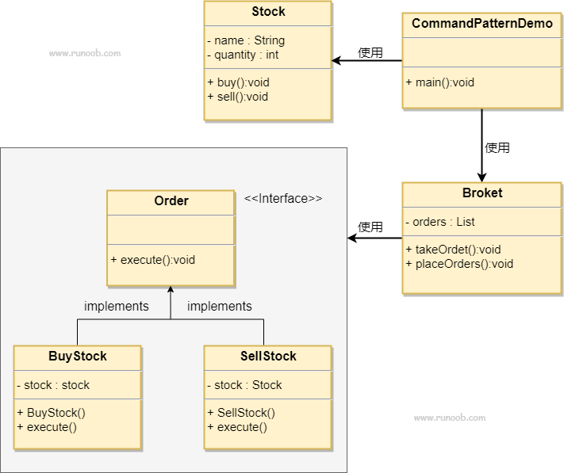

# 设计模式之命令模式

## 简介

命令模式，将一个请求封装为一个对象，从而使你可用不同的请求对客户进行参数化；对请求排队或记录请求日志，以及支持可撤销的操作。

命令模式的 UML 类图：



### Cpp 基本实现

```cpp

#include <iostream>
#include <string>
#include <list>

class Stock{
    public:
    void buy(){
        std::cout <<"Name: " << name<< " Quantity: "<< quantity<<" bought" <<std::endl;
    }
    void sell(){
             std::cout <<"Name: " << name<< " Quantity: "<< quantity<<" sold" <<std::endl;
    }
    private:
    std::string name = "abc";
    int quantity = 10;
};


class Order{
    public:
    virtual void execute()=0;
};

class BuyStock : public Order {
private:
  Stock* stock;

public:
   BuyStock(Stock* abcStock) { stock = abcStock; }

  void execute() { stock->buy(); }
};

class SellStock: public Order{
    private:
    Stock* stock;
    public:
    SellStock(Stock* abcSTock){
        stock = abcSTock;
    }
    void execute() {
        stock->sell();
    }
};

class Broker{
    private:
    std::list<Order*> orderList;

    public:
    void takeOrder(Order* order){
        orderList.push_back(order);
    }
    void placeOrder(){
        for( auto& order: orderList){
            order->execute();
        }
        orderList.clear();
    }
};


int main()
{
    Stock* abcStock = new Stock();

    BuyStock* buyStockOrder = new BuyStock(abcStock);
    SellStock* sellStockOrder = new SellStock(abcStock);

    Broker* broker = new Broker();
    broker->takeOrder(buyStockOrder);
    broker->takeOrder(sellStockOrder);
    broker->placeOrder();
    return 0;
}
```
