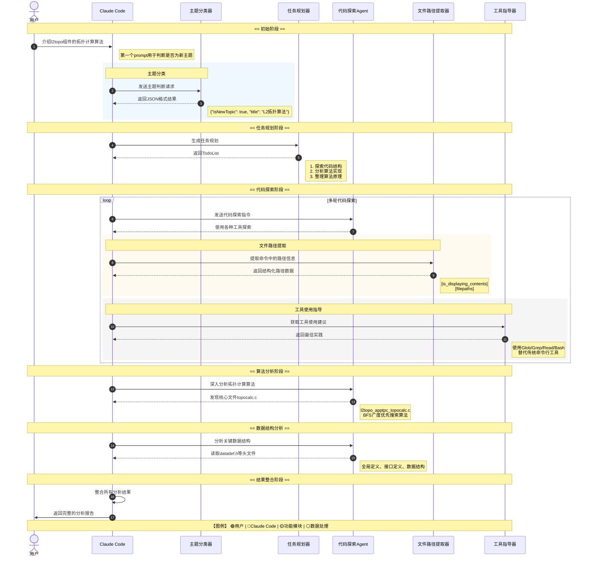

### 一、背景

为了探究Claude Code实际在产品中能力，我们在数通产品线的l2topo代码仓中向 Claude Code 提出了这样一个问题——“介绍一下 l2topo 组件的拓扑计算算法，以及对应的代码实现”。从前端命令行的视角看，这只是一轮普通的提问和一次普通的回答。但在后台，为了回答这一问题，Claude Code 实际上驱动 LLM 展开了 **32 轮内部对话**，期间多次调用各类工具、启动subagent、分阶段读取并分析代码文件，最后才构建出结构化、可解释的算法分析结果。

现在我们可以站在“系统运行时视角”，沿着这 32 轮对话的轨迹，观察：


- Claude Code 如何分阶段规划任务；
- 如何通过一组 system prompt 约束模型行为；
- 如何用工具把“看代码”拆分为一系列 API 调用；
- 主 agent 与 explorer subagent 如何协作，在节省上下文的同时保持过程可控、可解释。


以下为Claude Code中一个问题产生的与LLM交互的32次prompt和answer


---

### 二、多轮交互机制分析
以下是Claude Code背后的多轮交互的对话流程图：




整体来看，这 32 轮对话并不是简单的堆叠，而是大致可以分为以下几个阶段：

#### 2.1 主题识别阶段（第 1 轮）  
   第一个 prompt 的核心任务是识别当前用户消息是否开启了一个全新的对话主题，并为后续任务规划做准备。其原始英文 system prompt 片段如下：

   > You are Claude Code, Anthropic's official CLI for Claude.  
   > Analyze if this message indicates a new conversation topic. If it does, extract a 2-3 word title that captures the new topic. Format your response as a JSON object with two fields: 'isNewTopic' (boolean) and 'title' (string, or null if isNewTopic is false). Only include these fields, no other text. ONLY generate the JSON object, no other text (eg. no markdown).

   从这段原文可以看出，主题识别器的职责非常明确：  
   - 只判断“是否是新话题”以及“新话题标题是什么”；  
   - 只以严格的 JSON 形式返回结果（`isNewTopic` + `title`），不允许出现多余文本。  

   在这一轮中，系统返回了一个简单的 JSON：  
   `{"isNewTopic": true, "title": "L2拓扑算法"}`。  
   这个主题主要是为了在终端显示**当前任务的标题**

#### 2.2 任务规划阶段（第 2 轮）  
   第二轮的 `02_prompt_...` 是一个体量很大的 system prompt，其中包含了工具定义、使用规范，以及 TodoList 的结构与使用方式。其目标是让模型基于用户目标生成一个结构化的任务列表。  
   在这一轮，系统给出了 3 个任务：
   - 探索 l2topo 组件的代码结构和主要模块（置为 `in_progress`）；  
   - 分析拓扑计算算法的核心实现；  
   - 整理拓扑计算算法的原理和流程。  

   自此之后，整个分析过程就由这个结构化 TodoList 驱动，后续所有行为都围绕“完成这些任务并维护其状态”展开。

#### 2.3 代码探索与算法分析阶段（第 3–32 轮）  
   随后的对话中，Claude Code 使用多种工具和subagent 去：
   - 探索目录结构（如 `pwd`、`ls`、`tree`、`find` 等命令及其输出）；
   - 定位关键代码文件（例如 `topocalc.c`、`datadef.h` 等）；
   - 按模块阅读头文件与源文件；
   - 逐步抽取与拓扑计算相关的数据结构、核心函数和调用关系；
   - 最终生成一份结构化的算法分析结果，并同步更新 TodoList 状态。  

   在原始日志和分析整理中，这一大段过程又可以进一步拆分为若干子阶段：  
   目录结构探索、文件定位与初步分析、核心算法实现发现、数据结构分析、整体系统架构分析以及算法细节深入分析。可以将其理解为：Claude Code 正在引导 LLM，将“代码长什么样”逐步提升为“算法是如何实现的”。

在对应的流程图中，整个过程可以抽象为如下流水线：

> 用户提问 → 主题识别 → 任务规划（生成 TodoList） → 代码探索（subagent + 工具调用） → 算法分析 → 结果整合与任务状态更新

表面上用户只看到“一问一答”，实际上后台运行的是一条完整的、多阶段的“任务编排流水线”。

---

### 三、System Prompt与工具体系设计

真正值得关注的部分，从第 2 轮的 system prompt 开始。可以将这一部分理解为：Claude Code 是如何通过 system prompt 和工具体系来“教”模型工作的。

在 `02_prompt_...` 中，Claude Code 首先用一段较长的英文 system prompt 赋予模型“角色定位”和“工具箱”。其中最核心的一块是 Tools 定义，这部分通过 JSON 风格的描述，将每个工具的用途、约束和参数严格写入 prompt。典型示意如下（节选）：

> You may call one or more functions to assist with the user query.  
>  
> You are provided with function signatures within \<tools>\</tools> XML tags:  
> \<tools>  
> {"type": "function", "function": {"name": "Task", "description": "Launch a new agent to handle complex, multi-step tasks autonomously.  
>  
> The Task tool launches specialized agents (subprocesses) that autonomously handle complex tasks. Each agent type has specific capabilities and tools available to it.  
>  
> Available agent types and the tools they have access to:  
> - general-purpose: ...  
> - statusline-setup: ...  
> - Explore: ...  
> - Plan: ...  
> ...  
> }}  
> ...  
> \</tools>

整个工具体系大致可分为几类：

- **subagent 启动与任务下沉相关**：`Task`；  
- **代码与文件操作相关**：`Glob` / `Grep` / `Read` / `Edit` / `Write`；  
- **命令执行相关**：`Bash`（只用于真正需要 shell 的场景）及 `BashOutput` / `KillShell`；  
- **任务管理相关**：`TodoWrite`；  
- **外部信息获取相关**：`WebFetch` / `WebSearch`；  
- **交互与扩展相关**：`AskUserQuestion` / `Skill` / `SlashCommand` 等。

下面重点展开 `Task` 工具的设计，因为它直接决定了 Claude Code 的多 agent 协作策略。

#### 3.1 `Task` 工具：多 agent 协作的核心机制

在原始 system prompt 中，`Task` 的定义相对完整，既包含功能描述，也包含使用场景与禁用场景。关键片段如下：

> {"name": "Task", "description": "Launch a new agent to handle complex, multi-step tasks autonomously.  
>  
> The Task tool launches specialized agents (subprocesses) that autonomously handle complex tasks. Each agent type has specific capabilities and tools available to it.  
>  
> Available agent types and the tools they have access to:  
> - general-purpose: General-purpose agent for researching complex questions, searching for code, and executing multi-step tasks. When you are searching for a keyword or file and are not confident that you will find the right match in the first few tries use this agent to perform the search for you. (Tools: \*)  
> - statusline-setup: Use this agent to configure the user's Claude Code status line setting. (Tools: Read, Edit)  
> - Explore: Fast agent specialized for exploring codebases. Use this when you need to quickly find files by patterns (eg. "src/components/\*\*/\*.tsx"), search code for keywords (eg. "API endpoints"), or answer questions about the codebase (eg. "how do API endpoints work?"). ... (Tools: All tools)  
> - Plan: Fast agent specialized for exploring codebases. ... (Tools: All tools)  
>  
> When using the Task tool, you must specify a subagent_type parameter to select which agent type to use.  
>  
> When NOT to use the Task tool:  
> - If you want to read a specific file path, use the Read or Glob tool instead ...  
> - If you are searching for a specific class definition like "class Foo", use the Glob tool instead ...  
> - If you are searching for code within a specific file or set of 2-3 files, use the Read tool instead ...  
> - Other tasks that are not related to the agent descriptions above  
>  
> Usage notes:  
> - Launch multiple agents concurrently whenever possible, to maximize performance; ...  
> - When the agent is done, it will return a single message back to you. The result returned by the agent is not visible to the user. ...  
> - Each agent invocation is stateless. You will not be able to send additional messages to the agent, nor will the agent be able to communicate with you outside of its final report. Therefore, your prompt should contain a highly detailed task description ...  
> ..."

从这段英文定义可以概括出    几条设计要点：

- **角色定位**：  
  `Task` 并不是“帮我做一个小步骤”的 RPC，而是“拉起一个新的专用 agent ”，由该 agent 在独立上下文中完成复杂任务。

- **强约束的使用场景**：  
  Prompt 中明确列出了“什么时候不要用 `Task`”，例如只读某个具体文件、在少量特定文件中搜索类定义等，都要求直接使用 `Read` / `Glob` / `Grep`。这使得 `Task` 主要用于“边界不清、单次搜索可能找不准”的复杂探索任务。

- **一次性、自治式执行模型**：  
  `Task` 调起的subagent 只会在结束时返回 **一条最终消息**，中间过程不可交互。因此，主 agent 在构造 `Task` 的 `prompt` 字段时，必须一次性描述清楚任务目标、上下文背景、预期输出结构等。

- **多 agent 并发能力**：  
  System prompt 鼓励在适合的场景下并发启动多个subagent，以提升整体吞吐与探索效率。

在 l2topo 拓扑算法分析案例中，`Task` 与 `Explore` subagent 的组合，承担了“在大代码库中快速探索并归纳信息”的职责，从而显著降低了主对话上下文的压力。

#### 3.2 其他工具：受控的"安全版 Shell + 文件编辑 API"

除 `Task` 外，system prompt 中对其他工具也有严格约束，整体思路可以概括为：  
**所有“读/写代码、搜索文件、编辑内容”的操作都通过专用 API 完成，LLM 不直接操作 Shell**

简要总结如下：

- **文件与搜索相关**：  
  - `Glob`：代替 `find` / `ls` 做文件模式匹配，如 `**/*.c`、`src/**/*.ts`。  
  - `Grep`：代替 `grep` / `rg` 做内容搜索，支持多种输出模式和正则。  
  - `Read`：代替 `cat` / `head` / `tail`，统一输出格式，并带行号。  
  - `Edit` / `Write`：用于精确字符串替换或整文件覆盖，并要求在写之前必须先 `Read`。

- **终端执行（`Bash`）**：  
  只用于真正需要 shell 的操作（如运行测试、使用 `git` 等），禁止用 `cat` / `grep` / `find` / `sed` / `awk` / `echo` 等命令去做文件和内容操作，相关能力必须通过专用工具实现。

- **任务管理（`TodoWrite`）**：  
  在 system prompt 中有详细规则，包括：
  - Todo 项目必须有 `content` 与 `activeForm` 两种表达；  
  - 状态只允许在 `pending` / `in_progress` / `completed` 之间切换；  
  - 任意时刻只能有一个任务处于 `in_progress` 状态。  

整体上，这一套 system prompt 与工具体系，将 Claude Code 中的 LLM 定位为“一个严格遵守内部 API 规范的协作机器人”，而不是拥有完整 Shell 权限的root用户。

---

### 四、主从Agent协作机制

从第 3 轮开始，Claude Code 将“探索 l2topo 组件代码结构”的任务，交给了一个名为 **explorer** 的subagent。这个过程可以从 `03_answer` 中清晰看到：
```json
{
    "description": "探索l2topo组件结构",
    "prompt": "请探索l2topo组件的代码结构，找到主要的模块和文件，特别关注：\n1. l2topo组件的主要目录结构\n2. 拓扑计算相关的核心文件\n3. 算法实现的主要模块\n4. 入口文件和接口定义\n\n请提供详细的文件路径和简要说明每个文件的作用。",
    "subagent_type": "Explore"
}
```

- 主 agent 并未直接给出分析结论，而是通过 `Task` 工具发起调用：  
- `subagent_type: "Explore"`；  
- `prompt` 中详细描述了“请探索 l2topo 组件的代码结构，关注目录结构、核心文件、算法模块、入口文件和接口定义”等要求。

这意味着：主 agent 将“在代码库中进行大范围探索、定位关键信息”的职责外包给了 explorer subagent。那么，二者在 system prompt 和能力上的差异主要体现在：

#### 4.1 主agent与subagent的职责分工

##### 4.1.1 全局调度视角的主 agent
对应 `03_prompt`文件，从该文件中我们可以看到  
   - 能看到完整的 Tools 列表（包括 `Task`、`TodoWrite`、`Bash`、`Glob`、`Grep`、`Read`、`Edit`、`Write`、`WebFetch` 等）；  
   - 负责 **总任务管理**：维护 TodoList、决定何时启动subagent、何时回收结果，以及何时更新任务状态。

##### 4.1.2 聚焦"代码搜索与阅读"的 explorer subagent
 
   在 `04_prompt` 中，system prompt 直接给出了其角色设定：

   > You are a file search specialist for Claude Code…  
   > Your strengths: Rapidly finding files using glob patterns, searching code and text with regex, reading and analyzing file contents.

   - 工具集明显更“瘦身”：主要包括 `Bash`、`Glob`、`Grep`、`Read`、`WebFetch`、`WebSearch`、`BashOutput`、`KillShell`、`AskUserQuestion` 等，与“搜索/读取/分析代码与文档”高度相关；  
   - 不具备 `Task` 和 `TodoWrite` 等全局调度类工具，无法自行再派生新的 agent 或修改 TodoList。

#### 4.2 上下文窗口独立  
   Explorer subagent 的上下文与主对话相互独立。其直接收益包括：
   - **节省上下文**：大量 `pwd` / `ls` / `find` / `grep` 的输出只存在于 explorer 内部，不会挤占主 agent 的上下文窗口；  
   - **职责清晰**：主 agent 负责“做什么”（任务规划与结果整合），explorer 负责“这里代码长什么样”（结构探查与信息回报）。
#### 4.3 停止条件  
  一般来说subagent的任务执行有三种停止机制：模型自主判断完成、循环次数上限、超时限制。在这个问题中属于典型的"模型自主判断完成"模式。  
  在26轮对话中，explorersubagent成功完成并输出了详细的l2topo组件结构分析报告。通过分析26-prompt的设计，可以发现其停止的关键因素：  
  **1. 明确的角色定位与能力边界定义**  
  26-prompt首先为explorer subagent设定了专业化的角色身份：  
   > You are a file search specialist for Claude Code... You excel at thoroughly navigating and exploring codebases.
    Your strengths:
   > - Rapidly finding files using glob patterns
   > - Searching code and text with powerful regex patterns
   > - Reading and analyzing file contents
  
  这种专业化的角色定义让模型清楚自己的核心任务是"文件探索与分析"，而非代码修改或任务调度。  
  **2. 明确的任务目标清单**  
  prompt提供了结构化的任务框架：
  
  > 请探索l2topo组件的代码结构，找到主要的模块和文件，特别关注：
  1. l2topo组件的主要目录结构
  2. 拓扑计算相关的核心文件
  3. 算法实现的主要模块
  4. 入口文件和接口定义
 
这种清晰的列举式任务清单为模型提供了明确的目标导向，让探索过程有条不紊地进行。  

当模型认为已经获得"完整的l2topo组件代码结构概览"时，比如说是否涵盖了所有4个关注的任务点？ 否获得了足够的技术细节（文件路径、模块功能、关键算法）等时就会主动停止探索并生成结构化的最终报告。这种自主判断机制避免了无效的循环探索，保证了任务执行的效率。

到了第 27 轮 `27_answer`，可以看到一个明显的“上下文回归”信号: todolist被更新了,
```json
{
    "todos": [
        {
            "content": "探索l2topo组件的代码结构和主要模块",
            "status": "completed",
            "activeForm": "探索l2topo组件的代码结构和主要模块"
        },
        {
            "content": "分析拓扑计算算法的核心实现",
            "status": "in_progress",
            "activeForm": "分析拓扑计算算法的核心实现"
        },
        {
            "content": "整理拓扑计算算法的原理和流程",
            "status": "pending",
            "activeForm": "整理拓扑计算算法的原理和流程"
        }
    ]
}
```
- 说明此时再次由主 agent 说话，并更新 TodoList；  
- subagent 的探索结果被汇总到主上下文中，由主 agent 决定如何调整任务状态。  

这从侧面验证了：**只有主 agent 才能更新 TodoList，subagent 只是负责收集和加工信息**。

---

### 五、结构化信息提取机制

在完整的 32 轮对话中，有一条非常具有代表性的支线，围绕 `05_prompt_...` 等“路径提取”类 prompt 展开。

#### 5.1 整体Prompt分析

1. Explorer subagent 使用 `Bash` 工具执行命令，如 `pwd`、`ls`、`find`、`cat`、`git diff` 等；  
2. 其输出文本并不会直接被主逻辑消费，而是被交给另一次 LLM 调用，负责从中 **提取文件路径** 并判断这次命令是否真正“显示了文件内容”。

`05_prompt_...` 的 system prompt 核心逻辑可以概括为：

- **任务目标**：  
  从命令和输出中抽取所有“被读取或修改”的文件路径，尤其是对 `git diff`、`cat` 等“展示文件内容”的命令。

- **关键判断维度**：  
  需要先判断这条命令是否“显示了文件内容”。只有在 `is_displaying_contents = true` 的情况下，对应的路径才会被视为“内容级别的访问”，否则视为“仅展示路径或元信息”。

- **输出格式**：  
  严格限定为如下 XML 结构：

  ```xml
  <is_displaying_contents>
  true/false
  </is_displaying_contents>

  <filepaths>
  path/to/file1
  path/to/file2
  </filepaths>
  ```

- **重要特殊情况**：  
  对于 `ls`、`pwd`、`find` 等只展示目录或文件名的命令，即使输出中包含路径，也需要将 `is_displaying_contents` 设为 `false`，并允许 `<filepaths>` 为空。
#### 5.2 典型示例
在 `05_answer` 的一个典型示例中：

- 输入命令为 `pwd`，输出 `/usr1/l2topo`；  
- LLM 给出的 XML 为：

  ```xml
  <is_displaying_contents>
  false
  </is_displaying_contents>

  <filepaths>
  </filepaths>
  ```

乍看之下似乎“漏掉了路径”，但结合 system prompt 可以发现这是刻意设计：  
`pwd` 只返回当前工作目录，并不构成“读取了某个文件的内容”，因此不应该被记录为“内容访问路径”。

这一小模块反映出两个设计点：

1. Claude Code 并不是简单地依靠正则从命令输出中“硬抠路径”，而是通过一个轻量的“命令语义判断器” prompt，让 LLM 先理解命令类型，再决定是否以及如何返回路径信息。  
2. 通过 `is_displaying_contents` 这一布尔值，下游逻辑只在真正读取文件内容的情况下才记录“被阅读的文件”，从而减少无意义的噪音。
3. 这一过程Prompt不复杂，很短，而且输出格式固定，调用又较为频繁，属于那种人能一眼看出来，但是通过工具无法准确提取，在官方的claude code中极有可能是通过小型模型来完成的。

从工程角度来看，这是一种折衷方案：  
**让 LLM 负责“命令与路径的语义识别”，但输出必须是高度结构化、易于程序消费的中间表示。**

---

### 六、系统协作模型分析

结合上述 32 轮对话与 system prompt 设计，可以将 Claude Code 在本案例中的整体设计理念概括为以下几个方面。

#### 6.1 多轮规划驱动，而非"一发回答"  
   - 通过独立的主题识别器判断是否开启新话题，并为其生成简明标题；  
   - 使用重型 system prompt 和工具列表，让模型在第 2 轮生成结构化的 TodoList；  
   - 后续所有行为都围绕 TodoList 的状态变化来展开，形成“规划 → 执行 → 更新”的闭环。

#### 6.2 工具化一切，LLM 负责"任务编排"而非直接操作环境  
   - 找文件 → `Glob`；  
   - 搜内容 → `Grep`；  
   - 读文件 → `Read`；  
   - 改文件 → `Edit` / `Write`；  
   - 运行命令 → `Bash`（且被严格限制用途）；  
   - 管理任务 → `TodoWrite`；  
   - 深度探索 → `Task` + 各类subagent。  

   实质上，Claude Code 用工具层将 Shell、文件系统等“危险原语”彻底封装起来，LLM 只负责调用这些受控 API，避免直接接触底层环境。

#### 6.3 主/subagent 明确分工，通过独立上下文节省窗口  
   - 主 agent：  
     - 负责理解用户意图、创建和维护 TodoList、决定何时启动subagent、何时收回结果并更新任务状态；  
     - 拥有完整工具集，包括 `Task` 和 `TodoWrite`。  
   - explorer subagent：  
     - 专注于在代码库中挖掘信息，可使用 `Glob` / `Grep` / `Read` / `Bash` 等工具，但不修改全局任务结构；  
     - 在独立的上下文窗口中运行，避免大量命令输出污染主对话。  

   这种模式在节省上下文的同时，也让每个 agent 的职责更加纯粹、可验证。

#### 6.4 通过结构化中间表示把"原始日志"转化为"可编排的知识"  
   在整个流程中，Claude Code 多次引入结构化中间层：
   - 主题识别阶段：返回 JSON（`isNewTopic` + `title`）；  
   - 任务规划阶段：返回结构化 TodoList；  
   - 路径提取阶段：返回 `<is_displaying_contents>` + `<filepaths>` 的 XML；  
   - 算法分析阶段：生成结构化的算法与实现报告。  

   通过这些中间层，系统得以将“混乱的代码与命令输出”逐层压缩为可继续编排、可自动化处理的结构化数据。

---

### 七、结论

通过对这 32 轮内部对话和相关 system prompt 的还原，可以从一个具体案例中看到一套较为完整的AI Cli设计思路：

1. **以流程为中心，而不是以单次回答为中心**  
   Claude Code 将“看一段复杂代码并进行算法分析”拆解为“主题识别 → 任务规划 → 代码探索 → 数据与算法分析 → 结果整合”这样一条可解释的流水线，每一步都有明确的输入输出形式。

2. **用工具与协议将“读代码、改代码、跑命令、查文档、规划任务”串成统一框架**  
   工具层提供了受控的 API，system prompt 则给出了详细的使用协议：何时使用哪类工具、何时不应使用、如何避免直接操作危险原语。这种设计使得 LLM 更像一名遵守工程规范的协作伙伴，而不是一个无约束的自然语言接口。

3. **通过多 agent 架构兼顾探索深度与上下文效率**  
   主/subagent 的分工，使主对话保持简洁、聚焦“目标与计划”，而 explorer subagent 可以在独立上下文中执行大量“pwd/ls/grep/read”等操作，既提升了探索能力，又控制了上下文窗口占用。

4. **依托结构化中间结果构建可编排的“知识流水线”**  
   从 JSON 形式的主题信息，到 TodoList，再到 XML 形式的路径提取输出，以及最后的结构化算法报告，每一层都在把原始日志转化为可被程序进一步利用和编排的数据结构。

从工程实践的视角看，这一案例表明：  
在构建Agent应用时，关键并不在于模型一次给出答案，而是通过持续调用工具不断探索迭代给出答案，通过 system prompt、工具协议和多 agent 架构，搭建起一条稳定、可解释、可演化的交互与执行流程。这套流程一旦设计清晰、实现扎实，就可以在类似 l2topo 拓扑算法分析这样的复杂任务中，持续发挥作用。


